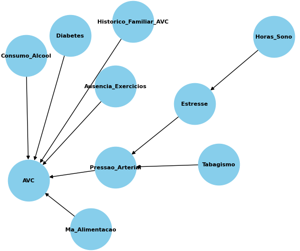

### UNIVERSIDADE FEDERAL RURAL DE PERNAMBUCO
### LICENCIATURA EM COMPUTAÇÃO - 2024.1
### INTELIGÊNCIA ARTIFICIAL
### PROFESSOR:
- ANDRÉ NASCIMENTO
### ALUNOS:
- FILIPE FALCÃO
- PEDRO HENRIQUE
- TÚLIO FALCÃO

## Predição de AVC com Redes Bayesianas

### Descrição
Este script Python [rede bayesiana](redebayes.py) utiliza a biblioteca pgmpy para construir e treinar uma rede bayesiana com o objetivo de prever a ocorrência de um Acidente Vascular Cerebral (AVC). A rede é treinada utilizando dados fictícios de um arquivo CSV (dadosAVC.csv) e os parâmetros são estimados utilizando o método de máxima verossimilhança.

### Requisitos
- Python: Versão 3.x
#### Bibliotecas:
- **pandas:**
    - Manipulação de dados
    - Versão 2.2.2
- **pgmpy:**
    - Utilizada para realização da modelagem e inferência em redes bayesianas
    - Versão: 0.1.25
- **matplotlib:**
    - Pacote python para plotagem gráfica
    - Versão: 3.9.1                                                     
- **networkx:**
    - NetworkX é um pacote Python para a criação, manipulação e estudo da estrutura, dinâmica e funções de redes complexas.
    - Versão: 3.2.1
        
### Estrutura do Arquivo CSV (dadosAVC.csv)
O arquivo CSV utilizado possui as seguintes características
| Campo | Valores |
| ----------- | ----------- |
| Idade | [inteiros] |
| Sexo: | ['M' 'F'] |
| Pressao_Arterial: | ['Alta' 'Baixa' 'Normal'] |
| Diabetes: | ['Sim' 'Não'] |
| Historico_Familiar_AVC: | ['Não' 'Sim'] |
| Ausencia_Exercicios: | ['Sim' 'Não'] |
| Ma_Alimentacao: | ['Sim' 'Não'] |
| Tabagismo: | ['Sim' 'Não'] |
| Consumo_Alcool: | ['Diario' 'Ocasional' 'Semanal' 'Nunca' 'Social' 'Diário'] |
| Horas_Sono: | [inteiros] |
| Estresse: | ['Alto' 'Baixo' 'Médio'] |
| AVC: | ['Não' 'Sim'] |

### Passo 1: Instalar as Bibliotecas Necessárias
Primeiro, você precisa instalar as bibliotecas necessárias. Você pode fazer isso usando o comando pip:

    pip install pandas pgmpy networkx matplotlib

### Passo 2: Importar as bibliotecas necessárias
Depois carregue as bibliotecas a serem utilizadas:

    import pandas as pd
    from pgmpy.models import BayesianNetwork
    from pgmpy.estimators import BayesianEstimator
    from pgmpy.inference import VariableElimination
    import networkx as nx
    import matplotlib.pyplot as plt

### Passo 3: Carregar os Dados
Carregar os dados do arquivo CSV

    data = pd.read_csv('dadosAVC.csv')
    print(data.head(10))

### Passo 4: Definir a Estrutura da Rede Bayesiana
Defina a estrutura da rede bayesiana especificando as relações entre as variáveis:

    model = BayesianNetwork([
        ('Horas_Sono', 'Estresse'),
        ('Pressao_Arterial', 'AVC'),
        ('Diabetes', 'AVC'),
        ('Historico_Familiar_AVC', 'AVC'),
        ('Ausencia_Exercicios', 'AVC'),
        ('Ma_Alimentacao', 'AVC'),
        ('Tabagismo', 'Pressao_Arterial'),
        ('Consumo_Alcool', 'AVC'),
        ('Estresse', 'Pressao_Arterial')
    ])

    # Visualizar a rede bayesiana
    def plot_network(model):
        G = nx.DiGraph()
        G.add_edges_from(model.edges())
        pos = nx.spring_layout(G)
        nx.draw(G, pos, with_labels=True, node_size=3500, node_color="skyblue", font_size=8, font_weight="bold", arrows=True)
        plt.title("Rede Bayesian")
        plt.show()
    
    plot_network(model)

**Exibição gráfica da estrutura da rede descrita:**

### Passo 5: Ajustar os Parâmetros da Rede
Ajuste os parâmetros da rede usando o estimador de máxima verossimilhança:

    model.fit(data, estimator=MaximumLikelihoodEstimator)

### Passo 6: Realizar Inferências na Rede
Use a eliminação de variáveis para realizar inferências na rede bayesiana:

    inference = VariableElimination(model)

#### Exemplo de consulta: Probabilidade de 'AVC' dado que a 'pressão arterial é alta':
Para isso fixamos o nosso alvo, AVC, e fixamos a evidência 'Pressao_Arterial', como "Alta':
    
    query_result = inference.query(variables=['AVC'], evidence={'Pressao_Arterial': 'Alta'})
    print(query_result)
Saída:
    
    #Exemplo de consulta: Probabilidade de 'AVC' dado que a 'pressão arterial é alta'
    +----------+------------+
    | AVC      |   phi(AVC) |
    +==========+============+
    | AVC(Não) |     0.4998 |
    +----------+------------+
    | AVC(Sim) |     0.5002 |
    +----------+------------+    

##### Exemplo de consulta: Probabilidade de 'AVC' dado que a pessoa 'tem diabetes' e 'histórico familiar de AVC':
Para isso fixamos o nosso alvo, AVC, e fixamos as evidências 'Diabetes', como "Alta'; 'Historico_Familiar_AVC', como 'Sim':

    query_result = inference.query(variables=['AVC'], evidence={'Diabetes': 'Sim', 'Historico_Familiar_AVC': 'Sim'})
    print(query_result)

Saída:

    Exemplo de consulta: Probabilidade de 'AVC' dado que a pessoa tem diabetes e histórico familiar de AVC
    +----------+------------+
    | AVC      |   phi(AVC) |
    +==========+============+
    | AVC(Não) |     0.4930 |
    +----------+------------+
    | AVC(Sim) |     0.5070 |
    +----------+------------+
